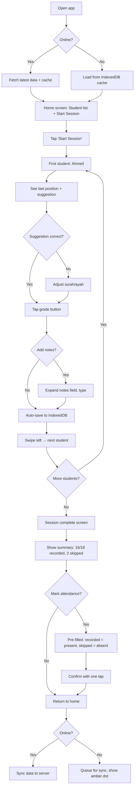
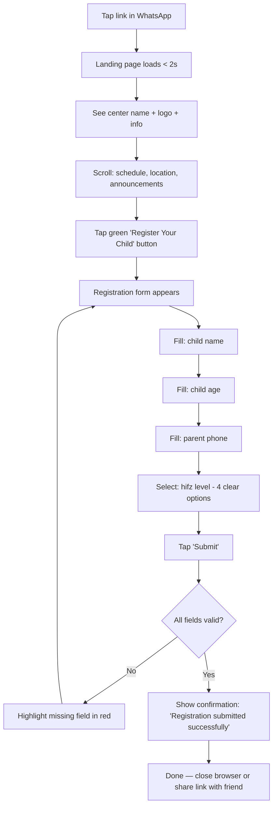
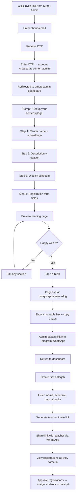
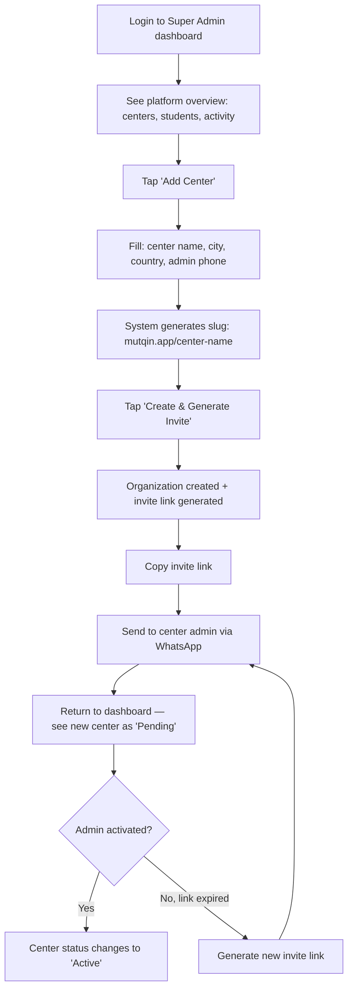

# UX Design Specification — Mutqin (مُتقِن)

**Author:** Ilyas
**Date:** 2026-04-13

---

<!-- UX design content will be appended sequentially through collaborative workflow steps -->

## Executive Summary

### Project Vision

Mutqin brings Quran memorization centers in East Africa their first digital presence. The platform replaces paper notebooks, Telegram chaos, and WhatsApp voice notes with a structured, mobile-first system that works offline in low-connectivity environments. The UX must serve users who range from tech-comfortable admins to parents who have never filled an online form — all on low-end Android devices over 2G-3G connections.

The core UX bet: if the landing page is beautiful enough to share and the recitation recording is faster than a notebook, adoption will be organic.

### Target Users

| Persona | Role | Device | Context | Core Need |
|---------|------|--------|---------|-----------|
| Ustadh Abdi | Center Admin | Samsung Galaxy A13, 3G | Manages 10+ halaqat via Telegram | See structured data for the first time — replace voice notes with forms |
| Mu'allim Yusuf | Teacher | Tecno Spark, 2G-3G | 18 students, records after Fajr in masjid | Record recitation faster than paper, offline, at 6 AM |
| Hoyo Amina | Parent | Basic Android, WhatsApp | Never filled an online form | Tap a link, register child in 2 minutes, done |
| Ilyas | Super Admin | Desktop/mobile | Platform operator | Onboard centers, monitor health, control access |

### Key Design Challenges

1. **Extreme device and connectivity constraints** — 500KB bundle budget, 200ms tap response, offline-first architecture. Every interaction must feel instant on low-end hardware over unreliable networks.
2. **Bidirectional layout (Arabic RTL + Somali LTR)** — The entire UI mirrors based on language selection. Quranic text remains Arabic regardless. All spacing, alignment, and gestures must work in both directions using CSS logical properties.
3. **Low tech literacy with high-stakes data** — Parents who have never used forms. Teachers who need to process 18 students without confusion. One frustrating experience loses the user to paper permanently.
4. **Session flow speed** — Full halaqah recitation recording must be faster than a paper notebook. Smart defaults, minimal taps, swipe-through flow. The teacher's daily workflow is the make-or-break experience.

### Design Opportunities

1. **Landing page as viral entry point** — A shareable, professional link that loads in 2 seconds on WhatsApp's in-app browser. Centers share it like they share Telegram group links — but this one *looks like a real organization*.
2. **Smart defaults and continuation** — Auto-suggesting next surah/ayah from last session reduces taps per student from 8-10 to 2-3. This is where "faster than paper" becomes undeniable.
3. **Calm offline experience** — No error states, no panic modals. A subtle offline indicator and seamless auto-sync. The teacher never thinks about connectivity — data just saves.

## Core User Experience

### Defining Experience

Mutqin has two defining interactions that must be flawless:

1. **Teacher records recitation for a full halaqah** — The daily core loop. Open app → see students → tap student → confirm suggested surah/ayah → pick grade → swipe to next. Entire halaqah done in under 10 minutes. Faster than a notebook, zero thinking required.

2. **Parent taps a WhatsApp link and registers their child** — The growth engine. See link → tap → see center info → tap "Register" → fill 4 fields → done. Under 2 minutes, no account needed, no confusion.

Everything else in the app exists to support these two moments.

### Platform Strategy

| Decision | Choice | Reason |
|----------|--------|--------|
| Platform | Mobile-first PWA | Works on any Android phone, installable, no app store needed |
| Primary input | Touch only | Large tap targets (44x44px minimum), thumb-friendly zones |
| Offline | Full offline for teacher flows | Recitation + attendance work without internet, sync silently |
| Languages | Arabic (RTL) + Somali (LTR) | Language picker on first launch, persists across sessions |
| Performance | <3s load on 3G, <200ms tap response | Non-negotiable for low-end devices |

### Effortless Interactions

These interactions must require zero thought from the user:

- **Smart continuation** — App remembers where each student left off. Teacher confirms with one tap instead of searching through surahs.
- **Bulk attendance defaults** — All students marked present. Teacher only taps the 1-2 absent students.
- **Offline transparency** — No error popups, no "you're offline" blocking modals. A small dot indicator. Data saves locally. Syncs when signal returns. The user never has to think about it.
- **Registration without accounts** — Parents fill a form and leave. No signup, no password, no email. Just name, age, phone, hifz level.
- **Invite-based onboarding** — No signup pages. Click a link, verify your phone, you're in. The system already knows your role and center.

### Critical Success Moments

| Moment | User | What happens | Why it matters |
|--------|------|-------------|----------------|
| First landing page share | Center Admin | Pastes link in Telegram, parents start registering | "My center exists online" — the hook that gets centers in |
| First structured data view | Center Admin | Sees registrations as a list instead of voice notes | "I can actually manage this" — the point of no return |
| First full halaqah recorded | Teacher | Finishes 18 students in 8 minutes | "This is faster than my notebook" — daily adoption locked in |
| First offline session | Teacher | Records recitation with no signal, it just works | "I can use this in the masjid" — trust established |
| Child registered in 2 minutes | Parent | Taps link, fills form, sees confirmation | "That was easy" — tells other parents |

### Experience Principles

1. **One tap over two** — If an interaction can be reduced by one tap, reduce it. Every extra tap is a chance to lose the user.
2. **Show, don't explain** — No tutorials, no onboarding wizards. The interface should be obvious. If it needs explanation, it's too complex.
3. **Works without signal** — The app must never punish the user for bad connectivity. Offline is the default state, online is a bonus.
4. **Arabic-first, always respectful** — Quranic text is sacred. Display it beautifully in Uthmani script. Never truncate ayat. RTL layout must feel native, not mirrored as an afterthought.
5. **Familiar over clever** — Use patterns users already know from WhatsApp and basic Android apps. No novel gestures, no hidden menus. Simple and obvious wins.

## Desired Emotional Response

### Primary Emotional Goals

| Emotion | Who feels it | When | Design implication |
|---------|-------------|------|-------------------|
| **Capable** | Teacher | Recording recitation, marking attendance | Smart defaults, minimal taps, fast response. The app does the thinking. |
| **Confident** | Parent | Registering their child | Simple form, instant confirmation, clear Arabic text. "I did that myself." |
| **Proud** | Center Admin | Sharing landing page, seeing structured data | Professional-looking page, organized data views. "My center looks real." |
| **Trusted** | All users | Every interaction | Data saves reliably, offline works silently, no surprises. |

### Emotional Journey Mapping

| Stage | Desired feeling | Anti-feeling to avoid |
|-------|----------------|----------------------|
| First open / landing page | "This looks professional" — Impressed | "This looks cheap" — Dismissive |
| Onboarding (invite + OTP) | "That was easy" — Relieved | "Why is this complicated?" — Frustrated |
| First task completed | "I can do this" — Capable | "I don't know what happened" — Confused |
| Daily use | "This just works" — Unburdened | "This is slower than paper" — Annoyed |
| Offline moment | "It still works" — Trusting | "Where did my data go?" — Panicked |
| Something goes wrong | "I know what to do" — Guided | "What just happened?" — Lost |
| Returning next day | "Right where I left off" — Comfortable | "I have to set everything up again" — Exhausted |

### Micro-Emotions

- **Confidence over confusion** — Every screen answers "what do I do here?" without explanation. If a user hesitates, the design failed.
- **Trust over skepticism** — Data saves visibly. The green checkmark after recording. The sync indicator that shows everything went through. Small signals that say "your work is safe."
- **Accomplishment over frustration** — The teacher finishes a halaqah and sees a completion state. The admin sees registration count go up. Progress is visible.
- **Belonging over isolation** — The center has a name, a logo, a page. The teacher is part of something organized. The parent knows where their child studies. Mutqin makes informal institutions feel *established*.

### Design Implications

| Emotional goal | UX approach |
|---------------|-------------|
| Capable | Pre-fill everything possible. Suggest next actions. Reduce choices to the minimum needed. |
| Confident | Large buttons, clear labels, instant feedback on every tap. No dead-end screens. |
| Proud | Clean typography, professional layout on landing pages. Data presented in organized tables, not raw lists. |
| Trusted | Auto-save on every field change. Visible sync status. Never lose data. Never show an empty screen when cached data exists. |
| Unburdened | No notifications asking for attention. No badges demanding action. The app serves the user's workflow, not the other way around. |

### Emotional Design Principles

1. **Respect over delight** — Don't try to be clever or fun. These users are teachers and parents doing serious work. Respect their time, their role, and the sacred nature of the content.
2. **Calm over exciting** — No animations for the sake of it. No confetti. Smooth, quiet transitions. The app should feel like a well-organized notebook, not a social media feed.
3. **Certainty over ambiguity** — Every action has clear feedback. Saved. Sent. Synced. Error. The user always knows the state of their data.
4. **Dignity over simplification** — "Simple" doesn't mean "dumbed down." The interface respects that users are intelligent people in a low-tech-literacy environment. Clean design, not childish design.

## UX Pattern Analysis & Inspiration

### Inspiring Products Analysis

**Tarteel (Quran Recitation AI)**
The gold standard for Quran app UX. Radically simplified home screen — just two primary actions. Surah/ayah navigation is fast and contextual. Quran data cached locally for instant offline access. Multiple Uthmani script options with proper connected-letter rendering. Long-press contextual menus respect RTL flow. The lesson: make the primary action obvious from the very first screen.

**Hifz Tracker / MyHifz (Hifz Progress Apps)**
Nail the daily logging workflow with New Memorization / Revision / Retention as distinct categories — maps exactly to Mutqin's New Hifz / Near Review / Far Review. Bulk page logging allows rapid entry for multiple students. Progress visualization (surah heatmaps, completion charts) motivates learners. Key gap: all are individual-only. None handle teacher-managing-20-students. Mutqin fills this.

**Google Classroom**
Clean information architecture: Stream (announcements) + Classwork (tasks) + People (roster) maps to Mutqin's Landing Page + Recitation + Students. But Classroom's offline is terrible — shows blank screens when connectivity drops, requires pre-setup while online. Mutqin must do the exact opposite: offline is the default state.

**Dukaan (SaaS Landing Page Builder)**
Mobile-first store creation wizard for merchants in India — same low-tech-literacy, mobile-only demographic as Mutqin's admins. 3-4 step wizard produces a shareable URL. One clean template with customizable fields beats a gallery of 20 choices. Pattern maps directly to Mutqin's center landing page builder.

**Klassly (Parent-Teacher Communication)**
Teacher-controlled announcements prevent the chaos of open group chats. No forced profile photo during signup — culturally critical for Mutqin's audience. The social-media-style feed for announcements is familiar to WhatsApp/Telegram users.

**Halaqat.online (Direct Competitor)**
Cloud-based Quran center management with AI evaluations. Targets Gulf/MENA markets. No Somali language, no offline capability, no M-Pesa, no landing page builder. Validates the market exists, confirms Mutqin's differentiation: "digital presence first" for East Africa.

### Transferable UX Patterns

**Navigation Patterns:**
- Bottom tab bar (3-4 tabs) — not hamburger menu. Tabs visible at all times: Home, Students, Record, Settings. Proven in WhatsApp, familiar to users.
- Two-action home screen (from Tarteel) — Teacher sees "Start Session" and student list. Admin sees "Landing Page" and management tabs.

**Interaction Patterns:**
- Bulk defaults + mark exceptions (from Hifz Tracker) — attendance defaults to all present, teacher taps 1-2 absences. Recitation defaults to suggested next surah/ayah, teacher confirms or adjusts.
- Swipe-through session flow — record one student, swipe to next. Progress indicator shows completed/remaining. From hifz tracker bulk logging pattern.
- Setup wizard → shareable URL (from Dukaan) — 3-4 steps: name/logo, description, schedule, registration fields. Produces `mutqin.app/{slug}` at the end.

**Visual Patterns:**
- Card-based lists for students, halaqat, registrations — familiar from WhatsApp chat lists.
- Subtle status indicators (colored dots, small badges) — not attention-demanding notifications.
- Clean Arabic typography using Cairo or Noto Sans Arabic for UI, Uthmani script for Quranic text.

**Offline Patterns (from PWA best practices):**
- Cache-first for static assets (Quran data, student lists, UI shell). Network-first for dynamic content (new registrations).
- Subtle offline banner: "Offline — data saves locally" — not alarming error modals.
- Local action confirmation: green checkmark when saved locally, sync icon when pushed to server.

### Anti-Patterns to Avoid

| Anti-Pattern | Source | Why it fails for Mutqin |
|-------------|--------|------------------------|
| Hamburger menu navigation | Google Classroom | Hides primary actions, increases cognitive load. Use bottom tabs instead. |
| Forced profile photo on signup | Klassly | Culturally inappropriate. Phone + name only. |
| Desktop-first responsive layout | Skolera, MySchool | Unusable on 5-inch screens. Must be mobile-first from pixel one. |
| Template gallery for landing pages | Generic builders | Choice paralysis. One clean template with customizable fields. |
| Blank screens when offline | Google Classroom | Destroys trust. Always show cached data, never a blank screen. |
| Enterprise feature density | MySchool | Requires IT support to troubleshoot. Mutqin users have zero IT help. |
| Individual-only hifz tracking | MyHifz, Hifz Tracker | No concept of centers, halaqat, or classrooms. Mutqin is institutional. |
| Subscription pricing | Most competitors | Doesn't match East African purchasing patterns. One-time license + low monthly fee. |

### Design Inspiration Strategy

**Adopt directly:**
- Two-action home screen pattern (Tarteel) — simplest possible entry to primary workflow
- Bottom tab navigation (WhatsApp pattern) — always visible, always reachable
- Bulk defaults + exceptions (Hifz Tracker) — fastest data entry for teachers
- Cache-first offline with subtle indicator (PWA best practices) — trust through reliability
- New / Near Review / Far Review categories (Hifz tracking convention) — familiar to Quran teachers

**Adapt for Mutqin's context:**
- Setup wizard → URL (Dukaan) — simplify to 3 steps for center landing page creation
- Card-based lists (WhatsApp) — adapt for student cards with last recitation position shown
- Progress visualization (Hifz Tracker) — Phase 2 feature, but design data model to support it now

**Avoid completely:**
- Hamburger menus, forced profile photos, desktop-first layouts
- Template galleries, feature-dense dashboards, blank offline screens
- Any UX pattern that requires explanation or onboarding tutorials

## Design System Foundation

### Design System Choice

**Tailwind CSS 4 + Headless UI + Custom Components**

A lightweight, performance-first design system built for Mutqin's constraints: 500KB bundle budget, RTL/LTR switching, low-end Android devices, and a 2-person team shipping in 1-2 months.

### Rationale for Selection

| Factor | Decision | Reason |
|--------|----------|--------|
| Bundle size | Headless UI over Radix/shadcn | Headless UI adds ~3KB gzipped vs ~15-25KB for Radix primitives |
| RTL support | Tailwind logical properties | `ms-`, `me-`, `ps-`, `pe-`, `text-start`, `text-end` — layout mirrors automatically with `dir="rtl"` |
| Accessibility | Headless UI | Keyboard navigation, ARIA attributes, focus management built into every component |
| Development speed | Custom components + Headless UI | ~8-10 core components covers all screens. No learning curve for a complex library. |
| Customization | Full ownership | Every component is your code. No fighting a library's opinions. |
| Long-term maintenance | Zero dependency risk | Headless UI is Tailwind Labs' own project. Tailwind CSS is the styling foundation. No third-party risk. |

### Implementation Approach

**Core Component Set (~8-10 components):**

| Component | Purpose | Headless UI? |
|-----------|---------|-------------|
| `Button` | Primary actions, submit, navigation | No — simple custom |
| `Input` | Text fields, phone number, search | No — simple custom |
| `Select` | Surah picker, grade selector, filters | Yes — Listbox |
| `Dialog` | Confirmations, OTP entry, error details | Yes — Dialog |
| `Card` | Student cards, halaqah cards, registration cards | No — simple custom |
| `Tabs` | Navigation sections, dashboard views | Yes — Tab Group |
| `Toast` | Save confirmation, sync status, errors | No — simple custom |
| `OfflineBanner` | Connectivity status indicator | No — simple custom |
| `Toggle` | Attendance present/absent switch | Yes — Switch |
| `Menu` | Settings, language picker, actions overflow | Yes — Menu |

**Typography:**
- UI text: Cairo (Arabic) / Inter (Latin/Somali) — loaded via `@font-face` with `font-display: swap`
- Quranic text: KFGQPC Uthmani Hafs — cached locally, loaded from `public/quran/`
- Base size: 16px minimum for readability on small screens

**Color Palette:**
- Primary: Deep green (Islamic cultural association, trust, growth)
- Surface: White/off-white cards on light gray background
- Text: Near-black for maximum readability
- Status: Green (saved/synced), amber (pending/offline), red (error)
- Accent: Kept minimal — color is for meaning, not decoration

**Spacing & Touch Targets:**
- Minimum tap target: 44x44px (Apple HIG / WCAG standard)
- Spacing scale: Tailwind defaults (4px base unit)
- Card padding: 16px minimum
- List item height: 56px minimum for comfortable touch

### Customization Strategy

**RTL Strategy:**
- Set `dir="rtl"` on `<html>` when Arabic is selected, `dir="ltr"` for Somali
- All Tailwind classes use logical properties exclusively — never `ml-`, `mr-`, `left`, `right`
- Test every component in both directions before shipping

**Theming:**
- CSS custom properties for colors, defined in Tailwind config
- Light theme only for MVP (dark mode deferred — saves bundle and testing time)
- "Powered by Mutqin" branding on free tier uses accent color on landing page footer

**Performance Budget Per Component:**
- No component should exceed 2KB gzipped
- Prefer CSS-only solutions (Tailwind) over JavaScript where possible
- Lazy-load non-critical components (Dashboard charts, Settings panels)

## Defining Experience

### The One-Sentence Experience

"Record a full halaqah of students in one flow — faster than a paper notebook."

This is what teachers will tell other teachers. This is the interaction that, if nailed, makes everything else follow. The landing page gets centers in the door, but the recitation recording flow is what keeps them.

### User Mental Model

**Current approach (paper notebook):**
1. Open notebook to student's page (flip through pages — slow)
2. Remember where student left off yesterday (rely on memory — error-prone)
3. Write surah name, ayah range, grade, notes (handwriting — slow)
4. Turn to next student's page (flip again)
5. Repeat 15-20 times

**Pain points the notebook creates:**
- Notebooks get lost (Mu'allim Yusuf lost his twice)
- No way to look up a student's history without flipping back weeks
- Admin can't see any of this data — it lives in the teacher's pocket
- Handwriting is hard to read later
- No attendance correlation

**Mutqin's mental model replacement:**
- Student list = "all my pages, already open"
- Smart suggestion = "the notebook remembers where I stopped"
- Swipe to next = "turning the page, but instant"
- Auto-save = "ink that never smudges or gets lost"

The key insight: teachers don't need to learn a new workflow. Mutqin mirrors the notebook flow but removes the friction at every step.

### Success Criteria

| Criteria | Target | How we know it works |
|----------|--------|---------------------|
| Full halaqah recorded | Under 10 minutes for 18 students | Timer from first tap to last save |
| Taps per student | 3-4 taps (confirm surah → grade → next) | When suggestion is correct, minimal input needed |
| Zero confusion on first use | Teacher records first student without help | No "what do I do?" moment |
| Works in the masjid | Full flow completes offline | No connectivity-dependent steps in recording |
| Data is never lost | Auto-save on every field change | Power outage mid-session loses zero data |
| Next-day continuity | Open app, pick up exactly where yesterday ended | Last position shown per student |

### Pattern Analysis

**Entirely established patterns — zero novel interaction required:**

| Interaction | Familiar from | Mutqin's version |
|------------|--------------|------------------|
| Scrollable list of students | WhatsApp contacts | Student cards with last position shown |
| Tap to select | Every mobile app | Tap student → recording form opens |
| Dropdown/picker selection | Phone settings, forms | Surah picker (Headless UI Listbox) |
| Swipe to advance | Photo galleries, stories | Swipe left → next student |
| Toggle switch | Phone settings | Present/absent attendance toggle |
| Pull to refresh | Social media feeds | Sync latest data when online |

No user education needed. Every interaction uses patterns they already know from WhatsApp and basic Android.

### Experience Mechanics

**1. Initiation — "Start Session"**

Teacher opens app → sees home screen with two clear actions:
- **"Start Session"** button (primary, large, green)
- Student list below showing all students with last position

Teacher taps "Start Session." The student list becomes the session flow — first student's recording form appears.

**2. Interaction — "Record Student"**

For each student, the teacher sees:
- **Student name** (large, top of screen)
- **Last position** ("Last: Al-Mulk, Ayah 10" — shown for context)
- **Suggested next** ("Continue: Al-Mulk, Ayah 11-15" — pre-filled)
- **Recitation type** (three large buttons: New Hifz / Near Review / Far Review — default based on pattern)
- **Surah/Ayah picker** (pre-filled with suggestion, tap to change)
- **Grade** (five large buttons: Mumtaz / Jayyid Jiddan / Jayyid / Maqbul / Da'if)
- **Notes** (optional text field, collapsed by default)

**Fastest path (suggestion is correct):** Tap grade → swipe to next student. **2 taps.**
**Adjusted path:** Change surah/ayah → tap grade → swipe. **4 taps.**

**3. Feedback — "You're on track"**

- **Per student:** Green checkmark appears on student card after recording. Card slides left, next student slides in.
- **Progress bar:** "7 / 18 students" shown at top. Teacher always knows how far along they are.
- **Auto-save:** Every field change saves to IndexedDB immediately. No "Save" button needed. If power dies mid-student, everything up to the last field change is preserved.
- **Skip:** Teacher can tap "Skip" to move past an absent student (or swipe past). Skipped students show as unrecorded, not absent.

**4. Completion — "Session Done"**

After the last student:
- **Completion screen:** "Session complete — 16/18 students recorded, 2 skipped"
- **Quick attendance prompt:** "Mark attendance now?" (pre-filled: all recorded students = present, skipped = absent). One tap to confirm.
- **Sync indicator:** If online, data pushes immediately. If offline: "Saved locally — will sync when connected" with a calm amber dot.
- **Return to home:** Home screen now shows today's session as complete. Student cards updated with new positions.

## Visual Design Foundation

### Color System

**Primary Palette:**

| Token | Hex | Usage |
|-------|-----|-------|
| `primary-600` | `#059669` | Primary buttons, active states, links |
| `primary-700` | `#047857` | Button hover, emphasis |
| `primary-800` | `#065F46` | Header backgrounds, strong emphasis |
| `primary-50` | `#ECFDF5` | Light backgrounds, selected states |
| `primary-100` | `#D1FAE5` | Subtle highlights, card accents |

**Neutral Palette:**

| Token | Hex | Usage |
|-------|-----|-------|
| `white` | `#FFFFFF` | Card backgrounds, input fields |
| `gray-50` | `#F9FAFB` | Page background |
| `gray-100` | `#F3F4F6` | Dividers, secondary backgrounds |
| `gray-200` | `#E5E7EB` | Borders, disabled states |
| `gray-500` | `#6B7280` | Placeholder text, secondary text |
| `gray-700` | `#374151` | Body text |
| `gray-900` | `#111827` | Headings, primary text |

**Status Colors:**

| Token | Hex | Usage |
|-------|-----|-------|
| `success` | `#059669` | Saved, synced, complete (same as primary) |
| `warning` | `#D97706` | Offline indicator, pending sync |
| `error` | `#DC2626` | Validation errors, failed sync |
| `info` | `#2563EB` | Informational messages |

**Semantic Mapping:**

| Purpose | Color | Rationale |
|---------|-------|-----------|
| "Data saved" checkmark | `success` green | Confirms action without interrupting flow |
| "Offline" dot | `warning` amber | Visible but not alarming — connectivity is expected to be unreliable |
| "Sync failed" alert | `error` red | Only after 3 retries — demands attention because data may need manual action |
| Grade: Mumtaz | `primary-600` | Best grade gets the brand color |
| Grade: Da'if | `error` red | Weakest grade stands out for teacher attention |
| Grades: middle three | `gray-700` | Neutral — no emotional weight on normal performance |

### Typography System

**Font Stack:**

| Context | Font | Weight | Fallback |
|---------|------|--------|----------|
| Arabic UI text | Cairo | 400, 600, 700 | system-ui, sans-serif |
| Somali/Latin UI text | Inter | 400, 500, 600, 700 | system-ui, sans-serif |
| Quranic text (surah names, ayat) | KFGQPC Uthmani Hafs | 400 | Amiri, serif |

**Type Scale:**

| Level | Size | Weight | Line Height | Usage |
|-------|------|--------|-------------|-------|
| Page title | 24px / 1.5rem | 700 | 1.3 | Screen titles ("My Halaqah", "Dashboard") |
| Section heading | 20px / 1.25rem | 600 | 1.35 | Card titles, section labels |
| Card title | 16px / 1rem | 600 | 1.4 | Student names, halaqah names |
| Body | 16px / 1rem | 400 | 1.5 | Form labels, descriptions, body text |
| Body small | 14px / 0.875rem | 400 | 1.5 | Secondary info, timestamps, metadata |
| Caption | 12px / 0.75rem | 400 | 1.4 | Badges, status labels, helper text |
| Quranic display | 20px / 1.25rem | 400 | 1.8 | Surah names, ayah text in picker |

**Typography Rules:**
- Minimum text size: 14px (never smaller — readability on low-end screens)
- Arabic text naturally renders larger than Latin at same pixel size — no adjustment needed
- Quranic text gets extra line height (1.8) for diacritical marks (tashkeel)
- Numbers in Arabic context use Eastern Arabic numerals (٠١٢٣٤٥٦٧٨٩) when UI is set to Arabic

### Spacing & Layout Foundation

**Spacing Scale (Tailwind defaults, 4px base):**

| Token | Value | Usage |
|-------|-------|-------|
| `1` | 4px | Tight gaps (icon-to-text) |
| `2` | 8px | Compact spacing (within components) |
| `3` | 12px | Default gap between inline elements |
| `4` | 16px | Card padding, section spacing |
| `6` | 24px | Between cards, between sections |
| `8` | 32px | Major section breaks |
| `12` | 48px | Page top/bottom padding |

**Layout Principles:**

- **Single column on mobile** — no side-by-side layouts on screens < 640px. Content stacks vertically.
- **Full-width cards** — cards stretch to screen edges with 16px horizontal margin. No floating elements.
- **Bottom-anchored primary actions** — "Start Session", "Save", "Submit" buttons live at the bottom of the screen, in thumb reach. Fixed position, always visible.
- **Top bar: minimal** — App name / screen title + offline indicator + language toggle. No clutter.
- **Bottom tab bar** — 4 tabs maximum. Icon + label. Always visible. 56px height for comfortable touch.

**Grid System:**
- Mobile (< 640px): Single column, 16px margins
- Tablet (640-1024px): 2-column grid where appropriate (admin dashboard, registration list)
- Desktop (> 1024px): Max-width 1024px container, centered. For Super Admin dashboard only.

**Card Design:**
- White background on gray-50 page
- 1px border `gray-200` (no shadows — saves rendering performance on low-end devices)
- 16px padding all sides
- 8px border radius
- Full width minus 16px margin each side

### Accessibility Considerations

**Contrast Ratios (WCAG AA minimum):**

| Combination | Ratio | Pass? |
|-------------|-------|-------|
| `gray-900` on `white` | 17.4:1 | Yes (AAA) |
| `gray-700` on `white` | 9.7:1 | Yes (AAA) |
| `primary-600` on `white` | 4.6:1 | Yes (AA) |
| `white` on `primary-700` | 5.7:1 | Yes (AA) |
| `warning` amber on `white` | 3.4:1 | Borderline — pair with icon + text label, never color alone |

**Touch Accessibility:**
- All interactive elements: 44x44px minimum tap target
- Spacing between tap targets: 8px minimum gap to prevent mis-taps
- Swipe gestures always have a tap alternative (button fallback)

**Visual Accessibility:**
- Never use color alone to convey status — always pair with icon or text label
- Offline status: amber dot + "Offline" text
- Success status: green checkmark + "Saved" text
- Error status: red circle + error message text

**Font Accessibility:**
- 16px minimum body text
- 700 weight for headings ensures visibility on low-contrast screens
- Cairo font chosen specifically for Arabic readability at small sizes

## Design Direction Decision

### Design Directions Explored

Four design directions were created and evaluated:

1. **Minimal Cards** — Generous white space, simple student cards (name + last position), full-width primary action button. Strength: clarity and calm. Weakness: fewer students visible at once.
2. **Compact List** — Dense rows with initial avatars, last surah position, color-coded grade badges, search bar, FAB. Strength: information density. Weakness: FAB is easy to miss.
3. **Session Flow Focus** — Recitation recording screen with smart surah suggestion, type buttons, grade buttons, progress bar. Evaluated as the core interaction screen.
4. **Landing Page Preview** — Public center page with hero, logo, stats, CTA button, announcements, branded footer. Evaluated as the viral entry point.

### Chosen Direction

**Hybrid of Direction 1 + 2 for app screens, Direction 3 for session flow, Direction 4 for landing page.**

**Student List (Home Screen):**
- Compact list layout (Direction 2) as default — shows more students per screen
- Initial avatar circle + student name + last surah/ayah + grade badge per row
- Search bar at top for halaqat with 15+ students
- Full-width "Start Session" button (from Direction 1) — not a FAB
- Bottom tab bar with icon + label: Home / Students / Record / Settings

**Recitation Recording (Session Flow):**
- Direction 3 as designed — student name, last position, smart suggestion highlighted in green
- Three recitation type buttons (New Hifz / Near Review / Far Review)
- Five grade buttons in a single row
- Collapsible notes field
- Progress bar ("7 / 18") at top
- Swipe-to-next with visual hint

**Public Landing Page:**
- Direction 4 as designed — hero with center name/logo, stats row, green CTA, announcements
- "Powered by Mutqin" footer on free tier
- Loads under 2 seconds on 3G — static HTML served by Caddy, no React bundle needed

### Design Rationale

| Decision | Why |
|----------|-----|
| Compact list over minimal cards for default | Teachers have 15-20 students. Seeing more per screen reduces scrolling during quick reference. |
| Full-width button over FAB | The "Start Session" action is the #1 thing on the screen. It should be impossible to miss. FABs get overlooked. |
| Search bar included | Scales for larger halaqat. Hidden by default on halaqat under 10 students (progressive disclosure). |
| Grade badge on list row | Teachers glance at the list to see who needs attention (Da'if badge in red stands out). No need to open each student. |
| Initial avatars | Faster scanning than plain text. First letter of student name in a colored circle — no photos needed (culturally appropriate). |
| Static landing page | Landing page doesn't need React. Server-rendered HTML from Go template = instant load, zero JS overhead for parents. |

### Implementation Approach

**Component Priority Order:**

| Priority | Component | Screen | Complexity |
|----------|-----------|--------|------------|
| 1 | StudentListRow | Home | Low — compact row with avatar, name, surah, badge |
| 2 | RecitationForm | Session | High — surah picker, grade buttons, auto-save, swipe |
| 3 | BottomTabBar | All screens | Low — 4 tabs, icon + label, active state |
| 4 | TopBar | All screens | Low — title, offline dot, language toggle |
| 5 | LandingPage | Public | Medium — Go HTML template, responsive, RTL |
| 6 | SessionProgressBar | Session | Low — "7/18" with fill bar |
| 7 | GradeButton | Session | Low — 5 buttons, color-coded Mumtaz through Da'if |
| 8 | AttendanceToggle | Attendance | Low — present/absent switch per student |

**Screen Inventory (MVP):**

| Screen | Role | Route |
|--------|------|-------|
| Login (OTP) | All | `/login` |
| Teacher Home | Teacher | `/` |
| Student List | Teacher | `/students` |
| Start Session | Teacher | `/session` |
| Record Student | Teacher | `/session/:studentId` |
| Session Complete | Teacher | `/session/complete` |
| Mark Attendance | Teacher | `/attendance` |
| Admin Dashboard | Center Admin | `/admin` |
| Halaqat List | Center Admin | `/admin/halaqat` |
| Registrations | Center Admin | `/admin/registrations` |
| Landing Page Editor | Center Admin | `/admin/landing` |
| Center Landing Page | Public | `/:slug` (server-rendered) |
| Platform Dashboard | Super Admin | `/platform` |
| Organizations List | Super Admin | `/platform/organizations` |
| Settings | All | `/settings` |

## User Journey Flows

### Journey 1: Teacher Records Daily Recitation

**User:** Mu'allim Yusuf | **Frequency:** Daily | **Context:** Masjid after Fajr, possibly offline



**Key interactions:**
- **Entry:** Open app → student list loads instantly from cache
- **Per student (fast path):** See suggestion → tap grade → swipe. **2 taps, <30 seconds**
- **Per student (adjusted):** Change surah/ayah → tap grade → swipe. **4 taps, <45 seconds**
- **Completion:** Summary → optional attendance → auto-sync
- **Error recovery:** If app closes mid-session, re-open shows session in progress with all previously saved students intact

### Journey 2: Parent Discovers and Registers

**User:** Hoyo Amina | **Frequency:** Once | **Context:** WhatsApp link on basic Android



**Key interactions:**
- **Entry:** WhatsApp link → server-rendered landing page (no React, no JS required)
- **Total time:** Under 2 minutes from tap to confirmation
- **Form fields:** Only 4 fields — child name, age, parent phone, hifz level. Nothing optional on screen.
- **No account required:** No signup, no email, no password. Just fill and submit.
- **Error recovery:** Inline validation — red border on empty required field, clear Arabic/Somali error message below

### Journey 3: Center Admin Sets Up Digital Presence

**User:** Ustadh Abdi | **Frequency:** Once (setup) | **Context:** First time using Mutqin after invite



**Key interactions:**
- **Onboarding:** Invite link → OTP → straight to setup wizard. No blank dashboard confusion.
- **Landing page builder:** 4-step wizard (name/logo → description/location → schedule → registration form). Preview before publish.
- **Shareable moment:** After publish, the copy-link button is prominent. Admin shares immediately.
- **First data:** Registrations appear as a list within hours. This is the "I can never go back to Telegram" moment.
- **Error recovery:** Each wizard step saves independently. Closing mid-setup preserves progress.

### Journey 4: Super Admin Onboards a New Center

**User:** Ilyas | **Frequency:** Weekly | **Context:** Desktop or mobile, always online



**Key interactions:**
- **Entry:** Login → platform dashboard shows all centers at a glance
- **Create center:** Single form, 4 fields. Slug auto-generated from name.
- **Invite:** Link generated on create. Copy button → WhatsApp.
- **Monitoring:** Dashboard shows center status (Pending/Active/Suspended), activity this week, pricing tier.
- **Error recovery:** Expired invite links can be regenerated. No data lost.

### Journey Patterns

**Patterns reused across all journeys:**

| Pattern | Usage | Implementation |
|---------|-------|---------------|
| **OTP verification** | Login, invite activation, teacher onboarding | Same component: phone/email input → OTP input → verified |
| **Invite → activate** | Center admin, teacher onboarding | Same flow: click link → enter contact → OTP → account created with role |
| **Copy shareable link** | Landing page URL, invite links | Same component: URL display + copy button + "Copied!" toast |
| **List → action** | Student list → record, registrations → approve, centers → manage | Same pattern: scrollable list → tap row → action screen |
| **Offline queue + sync** | Recitation, attendance | Same engine: save to IndexedDB → queue → auto-sync on connectivity |
| **Form validation** | Registration, center setup, halaqah creation | Same pattern: inline red border + error message below field |
| **Progress indicator** | Session flow (7/18), landing page wizard (step 2/4) | Same component: label + fill bar |

### Flow Optimization Principles

1. **Every journey starts in under 3 seconds** — cached data loads instantly, fresh data fetches in background.
2. **No dead ends** — every screen has a clear next action. Empty states show what to do ("No halaqat yet — create your first one").
3. **Save constantly, confirm rarely** — auto-save on every field change. Only confirm destructive actions (delete, deactivate).
4. **One journey, one session** — teacher records all students in one flow without returning to home. Admin sets up landing page in one wizard without navigation.
5. **Offline never blocks** — every teacher journey (recitation, attendance) completes fully offline. Admin journeys degrade gracefully (show cached data, queue writes).

## Component Strategy

### Design System Components

**From Headless UI (accessible, unstyled, we style with Tailwind):**

| Component | Headless UI | Used in |
|-----------|------------|---------|
| `Listbox` | Yes | Surah picker, ayah range picker, hifz level selector, country selector |
| `Dialog` | Yes | OTP entry, confirmations ("Deactivate this halaqah?"), error details |
| `Tab Group` | Yes | Admin dashboard sections, attendance filters (by halaqah/student/date) |
| `Switch` | Yes | Attendance present/absent toggle, language toggle |
| `Menu` | Yes | Settings overflow, actions menu on cards (edit/delete/deactivate) |
| `Combobox` | Yes | Student search in compact list, surah search by name |

**From Tailwind (CSS-only, no JS):**

| Pattern | Used in |
|---------|---------|
| Card layout | Student cards, halaqah cards, registration cards, announcement cards |
| Form inputs | All forms — text, tel, number inputs |
| Button variants | Primary (green), secondary (gray outline), danger (red), ghost |
| Badge | Grade badges, status badges (active/suspended/pending) |
| Progress bar | Session progress (7/18), wizard progress (step 2/4) |

### Custom Components

#### StudentListRow

**Purpose:** Display a student in the compact list with enough context for the teacher to act.

**Anatomy:**
```
[Avatar Circle] [Name          ] [Last Surah    ] [Grade Badge]
[  أ          ] [أحمد يوسف     ] [الملك، آية ١٠  ] [جيد جداً   ]
```

**Props:**
- `name` — student name (Arabic)
- `initial` — first letter for avatar circle
- `lastSurah` — last recorded surah name
- `lastAyah` — last recorded ayah number
- `lastGrade` — most recent grade (determines badge color)
- `isRecordedToday` — boolean, shows green checkmark if session done today
- `onClick` — tap handler

**States:**
- Default: white background, full info displayed
- Recorded today: green checkmark icon replaces grade badge
- Tapped/active: `primary-50` background highlight
- Offline cached: no visual difference (data is always local)

**Size:** Full width, 64px height. Avatar 40px circle. Grade badge 24px height.

#### RecitationForm

**Purpose:** The core recording interface — one form per student in the session flow.

**Anatomy:**
```
[Progress: ٧ / ١٨                              ]
[━━━━━━━━━━━━━━━━━━━━━━░░░░░░░░░░░░░░░░░░░░░░━]

أحمد يوسف                                    [Skip]
آخر موضع: الملك، آية ١٠

┌─────────────────────────────────────────────┐
│  تابع: الملك، آية ١١-١٥                      │
└─────────────────────────────────────────────┘

[حفظ جديد]  [مراجعة قريبة]  [مراجعة بعيدة]

[Surah: الملك ▾]  [From: ١١ ▾]  [To: ١٥ ▾]

[ممتاز] [جيد جداً] [جيد] [مقبول] [ضعيف]

[+ ملاحظات]                        ← swipe →
```

**Props:**
- `student` — student object (name, id, last position)
- `suggestion` — auto-generated next surah/ayah
- `progress` — current/total (e.g., 7/18)
- `onSave` — called on every field change (auto-save)
- `onNext` — swipe or tap to advance
- `onSkip` — skip this student

**States:**
- Default: suggestion pre-filled, awaiting grade selection
- Grade selected: grade button highlighted in its color, auto-saves
- Notes expanded: text field appears below grade buttons
- Saving: brief green flash on the form border (100ms)
- Error: red border if validation fails (shouldn't happen with pre-filled data)

**Auto-save behavior:** Every field change triggers `onSave` → writes to IndexedDB immediately. No submit button.

**Swipe behavior:** Horizontal swipe left triggers `onNext`. Swipe right goes to previous student. Visual arrow hints at bottom.

#### SurahPicker

**Purpose:** Select a surah from 114 options quickly, with ayah range.

**Anatomy:**
```
Surah: [الملك ▾]         ← opens Headless UI Listbox
Ayah from: [١١ ▾]   Ayah to: [١٥ ▾]
```

**Props:**
- `selectedSurah` — current surah number (1-114)
- `ayahFrom` — start ayah
- `ayahTo` — end ayah
- `onChange` — callback with {surahNumber, ayahFrom, ayahTo}

**Data source:** Static JSON from `public/quran/surahs.json` — cached in IndexedDB.

**Search:** Combobox variant allows typing surah name to filter. List shows: surah number + Arabic name + ayah count.

**Ayah range:** Dynamic — max value based on selected surah's total ayat. From/To pickers only show valid ayah numbers.

**Performance:** Surah list renders within 500ms from local cache (NFR6). All 114 items pre-loaded, no pagination.

#### GradeSelector

**Purpose:** Five large buttons for grading recitation quality.

**Anatomy:**
```
[ممتاز] [جيد جداً] [جيد] [مقبول] [ضعيف]
```

**Props:**
- `selectedGrade` — current selection or null
- `onChange` — callback with grade value

**Grade values and colors:**

| Arabic | English | Value | Selected color | Badge color |
|--------|---------|-------|---------------|-------------|
| ممتاز | Mumtaz (Excellent) | `mumtaz` | `primary-600` bg, white text | Green badge |
| جيد جداً | Jayyid Jiddan (Very Good) | `jayyid_jiddan` | `primary-100` bg, `primary-800` text | Light green badge |
| جيد | Jayyid (Good) | `jayyid` | `gray-100` bg, `gray-700` text | Gray badge |
| مقبول | Maqbul (Acceptable) | `maqbul` | `warning` bg light, `warning` text dark | Amber badge |
| ضعيف | Da'if (Weak) | `daif` | `error` bg light, `error` text dark | Red badge |

**States:**
- Default: all unselected, gray-100 background, gray-700 text
- Selected: one button highlighted with its grade color
- Tap feedback: 100ms scale animation (0.95 → 1.0)

**Size:** Each button minimum 60px wide, 44px tall. Flex row with 8px gap. Wraps to two rows on very narrow screens (<320px).

#### BottomTabBar

**Purpose:** Primary navigation for authenticated users. Always visible.

**Anatomy:**
```
[🏠 Home] [👥 Students] [🎙 Record] [⚙ Settings]
```

**Props:**
- `activeTab` — current active route
- `offlineQueueCount` — number of pending sync items (shown as small badge on Home tab)

**Tabs by role:**

| Tab | Teacher | Center Admin | Super Admin |
|-----|---------|-------------|-------------|
| Home | My halaqah + start session | Dashboard stats | Platform overview |
| Students | Student list | All students + registrations | All organizations |
| Record | Start session / attendance | Halaqat management | — (replaced by "Centers") |
| Settings | Language, profile | Language, profile, landing page | Language, profile, platform |

**States:**
- Active: `primary-600` icon + label
- Inactive: `gray-500` icon + label
- Badge: small red circle with count (sync queue items pending)

**Size:** 56px height. Full width, fixed to bottom. Safe area padding for notched phones.

#### OfflineBanner

**Purpose:** Subtle, non-alarming connectivity indicator.

**Anatomy:**
```
[● Offline — data saves locally]     ← amber dot + text, 32px height
```

**Props:**
- `isOnline` — boolean
- `syncQueueCount` — number of items waiting to sync
- `isSyncing` — boolean, true during active sync

**States:**
- Online: hidden (no banner shown — online is the expected state users don't need to think about)
- Offline: amber dot + "Offline — data saves locally" — slides down from top bar
- Syncing: green dot + "Syncing..." with subtle pulse animation
- Sync complete: green dot + "All synced" — auto-hides after 2 seconds
- Sync failed (after 3 retries): red dot + "Sync failed — tap to retry"

**Behavior:** Non-blocking. Never prevents user action. Never shows a modal. Just a calm 32px bar.

#### SessionProgressBar

**Purpose:** Show teacher's progress through the halaqah during a session.

**Anatomy:**
```
٧ / ١٨ طالب                    [━━━━━━━━━━░░░░░░░░░░]
```

**Props:**
- `current` — number of students recorded
- `total` — total students in halaqah
- `skipped` — number skipped

**States:**
- In progress: green fill proportional to current/total
- Complete: full green bar + "Session complete" text
- Has skipped: skipped count shown in gray: "٧ / ١٨ (٢ skipped)"

**Size:** Full width, 24px height. Fits above the RecitationForm.

#### AttendanceList

**Purpose:** Bulk attendance marking with all-present default.

**Anatomy:**
```
Mark Attendance — [date]

[Toggle: ✓] أحمد يوسف          ← present (default)
[Toggle: ✓] خالد عمر           ← present (default)
[Toggle: ✗] محمد علي           ← absent (tapped)

[Save Attendance]
```

**Props:**
- `students` — student list
- `date` — attendance date (defaults to today)
- `defaultStatus` — "present" (all toggle on by default)
- `onSave` — callback with attendance array

**Behavior:** All students default to present (Switch on). Teacher taps only the 1-2 absent students. Auto-saves on every toggle change. "Save Attendance" button for explicit confirmation.

#### EmptyState

**Purpose:** Guide users when a screen has no data yet.

**Anatomy:**
```
        [Simple icon]
    No halaqat yet
    Create your first halaqah to get started

    [Create Halaqah]    ← primary button
```

**Variants:**
- No halaqat: "Create your first halaqah"
- No students: "Approve registrations to add students"
- No registrations: "Share your landing page to receive registrations"
- No recitation today: "Start a session to record recitation"
- No attendance today: "Mark today's attendance"

**Purpose:** Never show a blank screen. Always tell the user what to do next.

### Component Implementation Strategy

**Build order follows user journey priority:**

| Phase | Components | Enables |
|-------|-----------|---------|
| Phase 1: Core shell | BottomTabBar, TopBar, OfflineBanner, EmptyState | App navigation and structure |
| Phase 2: Teacher flow | StudentListRow, RecitationForm, SurahPicker, GradeSelector, SessionProgressBar | Daily recitation recording (Journey 1) |
| Phase 3: Attendance | AttendanceList (reuses StudentListRow + Switch) | Attendance marking |
| Phase 4: Admin | Card variants, form components, wizard steps | Landing page builder, halaqah management (Journey 3) |
| Phase 5: Landing page | Server-rendered Go templates (no React components) | Public center page (Journey 2) |
| Phase 6: Platform | Table/list components for Super Admin | Platform management (Journey 4) |

### Implementation Roadmap

**Sprint 1 (Epic 1 — Foundation):**
- Button, Input, Card — basic Tailwind components
- BottomTabBar, TopBar — app shell
- OTP input component — auth flow
- OfflineBanner — connectivity awareness
- EmptyState — no blank screens

**Sprint 2 (Epic 2-3 — Admin + Landing):**
- Landing page Go templates (not React)
- Wizard step component — landing page builder
- Registration form — public form
- Card variants — registration cards, center cards

**Sprint 3 (Epic 4 — Halaqah):**
- StudentListRow — compact list
- Halaqah card — management view

**Sprint 4 (Epic 5 — Recitation):**
- RecitationForm — the defining experience
- SurahPicker — surah/ayah selection
- GradeSelector — five grade buttons
- SessionProgressBar — progress tracking

**Sprint 5 (Epic 6 — Attendance):**
- AttendanceList — bulk toggle

**Sprint 6 (Epic 8 — Dashboard):**
- Stat cards, simple charts/tables

## UX Consistency Patterns

### Button Hierarchy

| Level | Style | Usage | Example |
|-------|-------|-------|---------|
| **Primary** | `primary-600` bg, white text, full-width on mobile | One per screen. The main action. | "Start Session", "Publish", "Submit" |
| **Secondary** | White bg, `gray-200` border, `gray-700` text | Supporting actions alongside primary | "Cancel", "Skip", "Back" |
| **Danger** | White bg, `error` border, `error` text | Destructive actions only | "Deactivate", "Delete", "Reject" |
| **Ghost** | No bg, no border, `primary-600` text | Inline links, tertiary actions | "View all", "Edit", "Add notes" |

**Button rules:**
- Only ONE primary button per screen — if there are two important actions, one must be secondary
- Primary button at bottom of screen, fixed position, in thumb zone
- Minimum height: 48px. Full width on mobile, max-width 320px on tablet/desktop
- Danger buttons always require confirmation dialog before executing
- All buttons show loading spinner during async operations (no double-tap)
- Labels are verbs: "Save", "Create", "Submit" — never "OK" or "Yes"

### Feedback Patterns

**Success feedback:**

| Action | Feedback | Duration |
|--------|----------|----------|
| Field auto-saved | Brief green border flash (100ms) | Instant, no toast |
| Record saved | Green checkmark on student card | Persists until next session |
| Attendance saved | Green toast: "Attendance saved" | 2 seconds, auto-dismiss |
| Landing page published | Toast + confetti-free confirmation: "Page live at mutqin.app/slug" | 3 seconds |
| Sync complete | OfflineBanner: green dot + "All synced" | 2 seconds, auto-dismiss |

**Error feedback:**

| Error type | Feedback | Recovery |
|------------|----------|----------|
| Form validation | Red border on field + error message below | Fix field, error clears on valid input |
| API error | Red toast: "Something went wrong — try again" | Toast has "Retry" button |
| Sync failure (after 3 retries) | OfflineBanner: red dot + "Sync failed — tap to retry" | Tap retries immediately |
| Network timeout | No error shown — data saved locally, queued for sync | Transparent to user |
| 403 Forbidden | Redirect to login screen | Re-authenticate via OTP |

**Warning feedback:**

| Situation | Feedback |
|-----------|----------|
| Offline state | OfflineBanner: amber dot + "Offline — data saves locally" |
| Halaqah at capacity | Inline warning below enrollment: "Halaqah is full (30/30)" |
| Invite link expiring soon | Badge on invite: "Expires in 12 hours" |

**Rules:**
- Never show success toasts for auto-saved actions — it's too noisy for 18 students per session
- Errors that the user can fix show inline (form validation). Errors they can't fix show as toast.
- Never use modals for errors. Modals are only for destructive confirmations.
- All feedback text is translatable via i18next `t()` keys

### Form Patterns

**Input fields:**
- Label above field, always visible (never placeholder-only — placeholder disappears on focus)
- Placeholder text in `gray-500` as hint, not as label
- Error state: red border + red error message below field
- Valid state: no green border (don't celebrate normal behavior)
- Disabled state: `gray-100` bg, `gray-400` text

**Form layout:**
- Single column always. No side-by-side fields on mobile.
- Labels in Arabic align to the right (RTL). Labels in Somali align to the left (LTR). Automatic via `dir` attribute.
- Required fields: no asterisk. All visible fields are required. Optional fields are hidden behind "Add notes" or "More options" ghost buttons.
- Submit button at bottom, fixed position, always visible

**Input types by data:**

| Data | Input type | Keyboard |
|------|-----------|----------|
| Phone number | `type="tel"` | Numeric keypad |
| Child age | `type="number"` with min/max | Numeric keypad |
| Name | `type="text"` | Default keyboard |
| Notes | `<textarea>` auto-expanding | Default keyboard |
| Surah/ayah | Headless UI Listbox | No keyboard — tap to select |
| Grade | Button group | No keyboard — tap to select |
| Present/absent | Toggle switch | No keyboard — tap to toggle |

**Validation timing:**
- Validate on blur (when field loses focus), not on every keystroke
- Show error immediately on submit if fields are invalid
- Clear error as soon as user starts correcting (on focus or first keystroke)

### Navigation Patterns

**Primary navigation: Bottom tab bar**
- Always visible on authenticated screens
- 4 tabs max, icon + label
- Active tab: `primary-600`. Inactive: `gray-500`
- Tab changes are instant — no page transitions or loading screens for cached data

**Secondary navigation: Back arrow in top bar**
- Appears when navigating into a detail/sub screen
- Always returns to the previous screen (browser history-based)
- During session flow: back arrow goes to previous student, not home

**Tertiary navigation: Inline actions**
- "View all" links within dashboard cards
- "Edit" / "Delete" in card action menus (Headless UI Menu)
- Breadcrumbs: NOT used. Too complex for the audience. Back arrow is sufficient.

**Screen transitions:**
- No animations between screens (saves rendering time on low-end devices)
- Exception: swipe transitions in session flow (left = next student, right = previous)
- Pull-to-refresh on list screens when online

**Deep linking:**
- Every screen has a unique URL (TanStack Router)
- Share a registration link: `mutqin.app/{slug}` → landing page
- Invite links: `mutqin.app/invite/{token}` → onboarding flow
- App opened from homescreen: returns to last-visited screen

### Loading & Empty States

**Loading states:**

| Situation | Pattern |
|-----------|---------|
| First app load | Full-screen skeleton: gray rectangles matching layout |
| List loading | Skeleton rows (3-4 gray rectangles per row) |
| Button processing | Spinner replaces button label, button disabled |
| Background sync | No loading indicator — happens silently |
| Image upload | Progress bar inside the upload area |

**Empty states (always with action):**

| Screen | Empty message | Action button |
|--------|--------------|---------------|
| Teacher home (no halaqah assigned) | "You haven't been assigned to a halaqah yet. Ask your center admin." | No action (informational) |
| Student list (no students) | "No students enrolled yet" | "View Registrations" (for admin) |
| Registrations (none received) | "No registrations yet. Share your landing page to start receiving them." | "Copy Landing Page Link" |
| Dashboard (no data) | "Data will appear here once teachers start recording" | No action (informational) |
| Session (all students recorded) | "All students recorded today!" | "Mark Attendance" |

**Rule:** Empty screens always explain *why* it's empty and *what to do* to fill it. Never just show blank space.

### Confirmation Patterns

**When to confirm:**
- Deactivating a halaqah, teacher, or center (destructive, hard to undo)
- Rejecting a registration (affects a parent's submission)
- Logging out (in case it was accidental)

**When NOT to confirm:**
- Saving any data (auto-save, always)
- Marking attendance (toggles are instantly reversible)
- Recording recitation (auto-save per field)
- Navigating away from a form (data is already saved)
- Creating anything (create is never destructive)

**Confirmation dialog pattern:**
- Headless UI Dialog, centered
- Clear question: "Deactivate Halaqah Al-Noor?"
- Consequence: "Students and teacher will lose access. Data is preserved."
- Two buttons: "Cancel" (secondary, left) + "Deactivate" (danger, right)
- No "Are you sure?" — the dialog itself IS the confirmation

### RTL/LTR Consistency

**Automatic mirroring:**
- Entire layout mirrors when `dir="rtl"` is set on `<html>`
- Tailwind logical properties handle all spacing: `ms-`, `me-`, `ps-`, `pe-`, `text-start`, `text-end`
- Icons that indicate direction (arrows, chevrons) mirror. Icons that don't (search, settings, checkmarks) stay the same.
- Tab bar order mirrors: rightmost tab is "Home" in RTL

**Text direction exceptions:**
- Phone numbers always LTR (even in Arabic UI)
- URLs always LTR
- Quranic text always RTL (even in Somali UI)
- Numbers: Eastern Arabic (٠١٢٣) in Arabic UI, Western Arabic (0123) in Somali UI

**Testing rule:** Every screen must be visually tested in both Arabic (RTL) and Somali (LTR) before shipping.

## Responsive Design & Accessibility

### Responsive Strategy

**Mobile-first, mobile-primary.** Mutqin is designed for phones first. Tablet and desktop are secondary — used only by Center Admins and Super Admin for management tasks.

| Device | Primary user | Layout approach |
|--------|-------------|----------------|
| Mobile (320-640px) | Teacher, Parent, Center Admin | Single column, bottom tabs, full-width cards. This IS the app. |
| Tablet (640-1024px) | Center Admin | 2-column where useful (student list + detail side-by-side). Bottom tabs remain. |
| Desktop (1024px+) | Super Admin, Center Admin | Max-width 1024px container, centered. Side navigation replaces bottom tabs. |

**Mobile is not a "responsive version" — it's the primary design. Tablet and desktop adapt UP from mobile.**

### Breakpoint Strategy

| Breakpoint | Tailwind class | Layout change |
|-----------|---------------|---------------|
| < 640px (default) | — | Single column. Bottom tab bar. Full-width cards. Fixed bottom buttons. |
| ≥ 640px (`sm:`) | `sm:` | 2-column grids for admin lists (registrations, students). Cards get max-width. |
| ≥ 1024px (`lg:`) | `lg:` | Max-width 1024px container. Side nav replaces bottom tabs. Dashboard gets 3-column grid. |

**Rules:**
- All CSS is mobile-first: base styles are for mobile, `sm:` and `lg:` add complexity
- No breakpoint between 320-640px — design must work at 320px (smallest Android screens) without horizontal scrolling
- Bottom tab bar stays until `lg:` breakpoint — tablets still use bottom tabs (touch-friendly)
- Landing page (public) is fully responsive but optimized for mobile (most parents view in WhatsApp's in-app browser)

### Device-Specific Adaptations

**Mobile (320-640px) — the primary experience:**
- Single column, always
- Bottom tab bar: 56px height, 4 tabs
- Top bar: 48px height, title + offline dot + language toggle
- Cards: full width minus 16px margin each side
- Primary buttons: full width, fixed to bottom above tab bar
- Surah picker: full-screen overlay on tap (Headless UI Listbox takes full screen)
- Session flow: swipe gesture for next/previous student
- Keyboard: auto-focus on first input, `enterkeyhint` for form submission

**Tablet (640-1024px):**
- Admin dashboard: 2-column grid (stats left, activity right)
- Student list + detail: master-detail split (list left, selected student right)
- Registration list: table layout with columns (name, age, phone, status, actions)
- Landing page editor: preview panel beside editor
- Session flow: same as mobile (no benefit to multi-column for recording)

**Desktop (1024px+):**
- Side navigation replaces bottom tabs (vertical nav, left side, collapsible)
- Super Admin dashboard: 3-column grid for platform overview
- Tables for data-heavy screens (organizations list, audit log)
- Forms get max-width 480px, centered

### Accessibility Strategy

**Target: WCAG 2.1 Level AA**

This is the right level for Mutqin — it covers all essential accessibility without the extreme requirements of AAA that would add complexity without benefiting our users.

**Why AA and not A:**
- Our users include people with varying abilities and aging eyesight
- Arabic script at small sizes is harder to read — proper contrast matters more
- Touch accuracy on cheap phones varies — generous tap targets prevent errors
- AA is the global standard for public-facing web products

### Accessibility Checklist

**Visual accessibility:**

| Requirement | Standard | Mutqin implementation |
|-------------|----------|----------------------|
| Text contrast | 4.5:1 minimum (AA) | `gray-900` on white = 17.4:1, `primary-600` on white = 4.6:1 |
| Large text contrast | 3:1 minimum (AA) | All headings exceed 3:1 |
| Non-text contrast | 3:1 for UI components | All borders, icons, and interactive elements meet 3:1 |
| Color not sole indicator | Never use color alone | Status always has icon + text label alongside color |
| Text resize | Up to 200% without loss | Rem-based sizing, fluid layout, no fixed heights on text containers |
| Focus visible | Visible focus ring | 2px `primary-600` outline on all focusable elements |

**Motor accessibility:**

| Requirement | Standard | Mutqin implementation |
|-------------|----------|----------------------|
| Touch target size | 44x44px minimum | All buttons, toggles, list rows meet minimum |
| Target spacing | 8px minimum gap | Enforced in spacing system |
| Gesture alternatives | Tap alternative for all gestures | Swipe has "Next" button fallback. Pull-to-refresh has manual refresh button. |
| No time limits | No time-based interactions | OTP has 5-minute expiry with clear countdown + "Resend" option |
| Error prevention | Confirm destructive actions | All deactivate/delete actions require dialog confirmation |

**Cognitive accessibility:**

| Requirement | Mutqin implementation |
|-------------|----------------------|
| Consistent navigation | Bottom tab bar on every screen, same order, same icons |
| Predictable behavior | Same interaction patterns across all features (tap card → detail, swipe → next) |
| Error identification | Inline red messages below invalid fields, clear language |
| Labels and instructions | All form fields have persistent labels above input, never placeholder-only |
| Language level | Simple, clear Arabic and Somali. No jargon. Familiar Quran terminology only. |

**Screen reader support:**

| Element | ARIA implementation |
|---------|-------------------|
| Navigation tabs | `role="tablist"`, `role="tab"`, `aria-selected` |
| Student list | `role="list"`, `role="listitem"` |
| Grade buttons | `role="radiogroup"`, `role="radio"`, `aria-checked` |
| Attendance toggles | Headless UI Switch with `aria-label="Mark [name] present/absent"` |
| Surah picker | Headless UI Listbox with `aria-label="Select surah"` |
| Progress bar | `role="progressbar"`, `aria-valuenow`, `aria-valuemin`, `aria-valuemax` |
| Offline banner | `role="status"`, `aria-live="polite"` |
| Error messages | `role="alert"`, `aria-live="assertive"` |
| Dialogs | Headless UI Dialog handles focus trap and `aria-modal` automatically |

### Testing Strategy

**Device testing (real devices, not just emulators):**

| Device | Why | Test focus |
|--------|-----|-----------|
| Tecno Spark (or similar ~$80 Android) | Most common teacher device | Performance, touch accuracy, offline behavior |
| Samsung Galaxy A13 | Common admin device | All admin flows, landing page editor |
| iPhone SE (smallest modern iOS) | Smallest viewport | Layout at 320px width |
| iPad | Tablet layout | 2-column admin views |

**Browser testing:**

| Browser | Priority | Notes |
|---------|----------|-------|
| Chrome Android | Critical | 90%+ of users. Test PWA install, Service Worker, IndexedDB |
| Samsung Internet | High | Pre-installed on Samsung devices, significant market share in Africa |
| WhatsApp in-app browser | High | Landing page must render perfectly here — this is where parents first see Mutqin |
| Safari iOS | Medium | For the occasional iPhone user |
| Chrome Desktop | Low | Super Admin only |

**Accessibility testing:**

| Test | Tool | Frequency |
|------|------|-----------|
| Automated scan | axe-core (via browser extension) | Every PR — catches ~30% of issues |
| Contrast check | Built into browser DevTools | During component development |
| Keyboard navigation | Manual | Every new screen — tab through entire flow without mouse |
| Screen reader | TalkBack (Android) | Before each epic ships — full journey test |
| RTL visual review | Native Arabic speaker | Before each epic ships — check every screen in RTL |

**Network testing:**

| Condition | Tool | What to verify |
|-----------|------|---------------|
| 3G throttled (1 Mbps) | Chrome DevTools Network throttling | Page load < 3s, student list < 1s |
| Offline | Chrome DevTools → toggle offline | Full session recording flow works, data persists |
| Flaky connection | Toggle online/offline repeatedly | Sync queue handles interruptions, no duplicate records |

### Implementation Guidelines

**For developers — the rules:**

1. **Write mobile CSS first.** Base styles = mobile. Add `sm:` and `lg:` for larger screens. Never write desktop-first and then try to shrink.

2. **Use rem, not px.** Exception: borders (1px) and specific component sizes defined in the design system. Everything else scales with user's font size preference.

3. **Every interactive element needs:**
   - Visible focus ring (`:focus-visible` with `primary-600` outline)
   - `aria-label` if the visual label isn't sufficient for screen readers
   - Minimum 44x44px tap target
   - Keyboard operability (Enter/Space to activate, Escape to dismiss)

4. **Every image needs:**
   - `alt` text (center logos: `alt="[Center name] logo"`)
   - `loading="lazy"` for below-the-fold images
   - Max-width: 100% (never overflow container)

5. **Every form needs:**
   - `<label>` element linked to input via `htmlFor`
   - Error messages linked via `aria-describedby`
   - `autocomplete` attributes where applicable (name, tel, email)
   - Logical tab order (top-to-bottom, matches visual flow in both RTL and LTR)

6. **Test with TalkBack before shipping.** Not just "does it read the screen" — can a blind user complete the entire journey?
